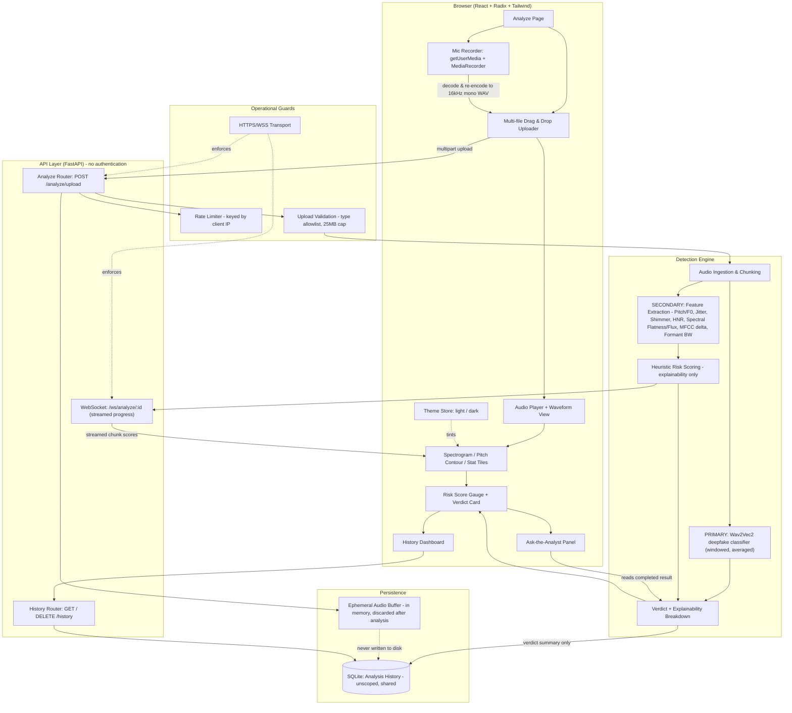

# VoiceGuard-AI

**Real-time detection of AI-cloned voices in calls.** Upload a recording or capture one live from your mic, and get an explainable verdict on whether the speaker is a real human or an AI-generated clone.

Built for **Smart India Hackathon 2026 · Problem Statement SIH26104** — *AI-Powered Real-Time Detection and Prevention of Voice Cloning Impersonation Attacks* (Theme: Blockchain & Cybersecurity) by **Team Victrix**.

> India loses over ₹22,000 crore annually to telephonic cyber-fraud, including AI voice-cloning vishing and "digital arrest" scams. Voice cloning now needs only a few seconds of reference audio, and caller ID or manual call-backs can no longer tell a real caller from a synthetic one.

---

## What it does

- **Upload or record** — drag in multiple audio files at once, or record live from your microphone.
- **Trained-model verdict** — a Wav2Vec2 classifier fine-tuned for synthetic-speech detection decides real vs. cloned, with a 0–100 risk score and confidence.
- **Live streaming analysis** — per-chunk risk scores stream over a WebSocket at roughly one per second, mirroring how the system would score a call in progress.
- **Visual voice forensics** — waveform, mel spectrogram, and pitch (F0) contour rendered from the actual audio.
- **Explainable breakdown** — jitter, shimmer, harmonics-to-noise ratio, spectral flux, formant stability and more, shown as supporting signal-level context.
- **Privacy-preserving** — uploaded audio is analyzed in memory and discarded; only the verdict summary is stored.
- **No sign-up** — open the analyzer and start; there are no accounts to create. Abuse protection is a per-IP rate limit and an upload type/size allowlist.

## Architecture



## Tech stack

| Layer | Stack |
|---|---|
| Frontend | React 19, Vite, TypeScript, Tailwind CSS v4, Radix primitives, Framer Motion, Recharts, Zustand, driver.js, assistant-ui |
| Backend | Python 3.13, FastAPI, Uvicorn, WebSockets, SQLModel + SQLite |
| Audio / ML | PyTorch (CPU), Transformers, librosa, NumPy, SciPy, soundfile |
| Guards | In-memory per-IP rate limiting, upload type/size validation |

## Quick start

### Backend

```bash
cd backend
python -m venv venv
./venv/Scripts/activate                                        # Windows
# source venv/bin/activate                                     # macOS / Linux
pip install torch --index-url https://download.pytorch.org/whl/cpu
pip install -r requirements.txt
uvicorn app.main:app --reload --port 8000
```

First run downloads the detection model (~1.2 GB, cached in `~/.cache/huggingface`). The server starts immediately and warms the model in the background — `GET /api/health` reports `detector_ready`.

### Frontend

```bash
cd frontend
npm install
npm run dev
```

Open **http://localhost:5173**. The dev server proxies `/api` and `/ws` to port 8000, so no CORS setup is needed.

To deploy the frontend separately from the backend, build with the API origin baked in:

```bash
VITE_API_BASE_URL=https://your-backend.example.com npm run build
```

Leave it unset when a reverse proxy serves both from the same origin.

## Interface

The UI is a corporate-minimal design system: Helvetica throughout, a warm off-white light theme and a neutral charcoal dark theme (toggle in the header, remembered per browser and defaulting to your OS preference). Depth comes from hairline borders, tonal surface steps and real CSS 3D perspective — no shadows, glass or gradients.

- **Looping logo animation** — the shield mark rotates a full turn on the Y axis while the wordmark re-reveals letter by letter, in phase.
- **3D voiceprint hero** — concentric rings of bars projected with a rotation matrix and perspective divide on a plain 2D canvas, steered gently by the cursor. No WebGL dependency.
- **Guided tour** — driver.js walkthrough of the analysis flow, restyled to the palette.
- **Ask the analyst** — assistant-ui Thread/Composer primitives on a custom local runtime that answers from the real analysis payload. Deterministic, no LLM call, no API key.

All motion respects `prefers-reduced-motion`.

## How detection works

**Primary — trained model.** [`garystafford/wav2vec2-deepfake-voice-detector`](https://huggingface.co/garystafford/wav2vec2-deepfake-voice-detector) (Apache-2.0), a Wav2Vec2-XLSR classifier fine-tuned on human recordings plus clips generated by ElevenLabs, Amazon Polly, Kokoro, Hume AI, Speechify and Luvvoice. Clips over 10s are scored in windows and averaged; clips under 2.5s are flagged as less reliable. This produces the verdict.

**Secondary — signal heuristics.** Classic forensics features (F0 jitter, amplitude shimmer, harmonics-to-noise ratio, spectral flatness/flux, zero-crossing variance, MFCC delta variance, formant bandwidth stability) computed with librosa. These are shown for explainability but **do not decide the verdict** — during development the heuristic scored a synthetic TTS sample as "real" with 97% confidence while the trained model correctly called it 99.4% fake. Modern cloning reproduces natural jitter and shimmer, so hand-tuned thresholds are not reliable on their own.

Both layers sit behind small interfaces in `backend/app/routers/ws.py` — `trained_detector.predict()` and `score_features()` — so a different checkpoint (or an AASIST/RawNet2 model trained on ASVspoof, as the original submission proposed) can be swapped in without touching the API or frontend.

## Limitations

This is a **hackathon prototype**, not a production system:

- Detection accuracy is bounded by the pretrained checkpoint; it has not been benchmarked against an independent labeled set here.
- Analysis runs on uploaded/recorded clips, not on a live telephony stream.
- There is no authentication. Anyone who can reach the server can analyse audio, and the history list is shared by all users of an instance — put it behind a reverse proxy or a private network before exposing it publicly.
- Inference is CPU-only at ~2–6s per clip.

## Documentation

See [`docs/README.md`](docs/README.md) for setup detail, the feature table, and calibration notes, and [`docs/architecture.mmd`](docs/architecture.mmd) for the diagram source. The original idea submission is in [`SIH26104_Victrix_VoiceGuardAI.pdf`](SIH26104_Victrix_VoiceGuardAI.pdf).
